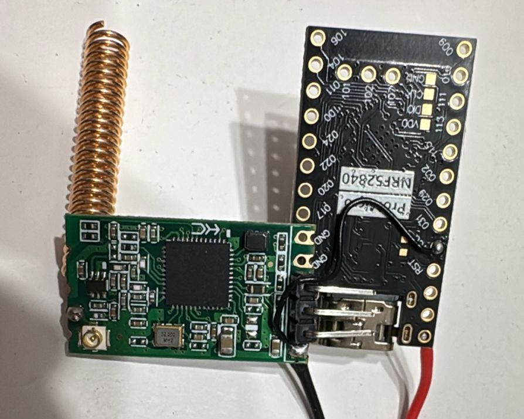

# nRF52840 ProMicro BLE UART Bridge for MeshCore

Firmware for an nRF52840 ProMicro-form-factor board (Nice!Nano-compatible) that exposes a simple UART protocol to control a BLE peripheral. Intended to be used with MeshCore as an external BLE module over UART.

Related project (modified MeshCore with BLE support):  
https://github.com/bve/MeshCore_STM32WLE5_BLE

## Overview

- Acts as a BLE peripheral using Nordic NUS (UART over BLE) via Adafruit Bluefruit stack.
- Controlled over UART by a host MCU (e.g., STM32WLE5 running MeshCore).
- Provides commands to set device name/PIN, advertise, connect/disconnect, and send/receive frames.

Core entry points:
- Application: [src/main.cpp](src/main.cpp)
- BLE command bridge: [include/BLEBridge.h](include/BLEBridge.h), [src/BLEBridge.cpp](src/BLEBridge.cpp) (command parsing and UART protocol, see [`BLEBridge::dispatchCommand`](src/BLEBridge.cpp))
- BLE transport: [include/SerialBLEInterface.h](include/SerialBLEInterface.h) (see [`SerialBLEInterface::begin`](include/SerialBLEInterface.h)), [src/SerialBLEInterface.cpp](src/SerialBLEInterface.cpp)
- Board variant/pins: [variants/nicenano/variant.h](variants/nicenano/variant.h), [variants/nicenano/variant.cpp](variants/nicenano/variant.cpp)
- PlatformIO config: [platformio.ini](platformio.ini)
- LED helper: [include/led.h](include/led.h), [src/led.cpp](src/led.cpp)

## Hardware

- Board: Nice!Nano/nRF52840 ProMicro layout (Adafruit nRF52 core).
- UART to host:
  - Port: `Serial1` at 115200 8N1 (see [src/main.cpp](src/main.cpp)).
  - Pins (from [variants/nicenano/variant.h](variants/nicenano/variant.h)):
    - TX: `PIN_SERIAL1_TX` = 6 → P0.00
    - RX: `PIN_SERIAL1_RX` = 8 → P0.01
- Optional power control pin for your radio/module:
  - `VSSPOW` = `PIN_013` → P0.13, driven HIGH in setup (see [src/main.cpp](src/main.cpp)).
- LED: `PIN_015` → P0.15 (see [include/led.h](include/led.h)).

All IO is 3.3V.

## Build and Flash

Prerequisites:
- VS Code + PlatformIO extension (recommended), or `pio` CLI.
- Board set to `nicenano` with Adafruit nRF52 core (see [boards/nicenano.json](boards/nicenano.json)).

Build:
- VS Code: “PlatformIO: Build”
- CLI: `pio run`

Flash (two options):

1) Default (nrfutil, serial bootloader)
- VS Code: “PlatformIO: Upload”
- CLI: `pio run -t upload`

2) UF2 (drag-and-drop)
- Optionally enable the UF2 upload flow in [platformio.ini](platformio.ini) by uncommenting the custom upload lines, or:
  - Build ELF/HEX, then run the included UF2 converter [upload/uf2conv.py](upload/uf2conv.py) manually.
  - Enter bootloader (double-press reset) to mount `NICENANO`.
  - Copy the generated `flash.uf2` to the mounted drive.

Example manual UF2 conversion:
- Convert HEX to UF2 and auto-deploy:
  - `python upload/uf2conv.py .pio/build/nicenano/firmware.hex --family 0xADA52840 --deploy`

## Runtime

The firmware creates a `BLEBridge` instance that listens on `Serial1` for commands from the host and interacts with the BLE stack via [`SerialBLEInterface`](include/SerialBLEInterface.h). See [src/main.cpp](src/main.cpp).

- Default UART: 115200 8N1
- The bridge looks for the prefix `&`, then a command line ending with `\n` (see [`BLEBridge::loop`](src/BLEBridge.cpp)).

### Commands

Implemented in [`BLEBridge::dispatchCommand`](src/BLEBridge.cpp):

- `&BEG <name> <pin>` — Initialize BLE with a device name and PIN code (pairs with MITM/PIN). Calls [`SerialBLEInterface::begin`](include/SerialBLEInterface.h).
- `&ENA` — Enable interface and start advertising.
- `&DIS` — Disable interface and disconnect/stop advertising.
- `&STA` — Start advertising (manual).
- `&STP` — Stop advertising (manual).
- `&STS` — Print status: ENABLED, CONNECTED, WRITE_BUSY.
- `&ISE` — Print `1` if enabled, else `0`.
- `&ISC` — Print `1` if connected, else `0`.
- `&ISW` — Print `1` if write busy, else `0`.
- `&WRI <len>` — Host-initiated TX. Bridge replies `RDY`, then host must send `<len>` raw bytes. Returns the number of bytes accepted.
- `&CHE` — Host-initiated RX poll. Returns available length; if non-zero, the bridge waits for `RDY` and then sends the bytes.

Notes:
- BLE TX power can be tuned via `BLE_TX_POWER` (default 4 dBm) in [`SerialBLEInterface`](include/SerialBLEInterface.h).
- MTU/connection parameters are set for higher throughput in [src/SerialBLEInterface.cpp](src/SerialBLEInterface.cpp).

### Quick Start (host side)

1) Configure BLE name and PIN:
   - `&BEG MyMeshBLE 123456`
2) Start advertising:
   - `&ENA`
3) Send a frame:
   - `&WRI N` → wait for `RDY`, then send N raw bytes.
4) Poll for received data:
   - `&CHE` → if non-zero length returned, send `RDY` and read the payload.

## Pinout Reference

- `Serial1 TX` → P0.00, `Serial1 RX` → P0.01 (see [variants/nicenano/variant.h](variants/nicenano/variant.h))
- `VSSPOW` → P0.13, set HIGH in setup (see [src/main.cpp](src/main.cpp))
- `LED` → P0.15 (see [include/led.h](include/led.h))

## License

MIT